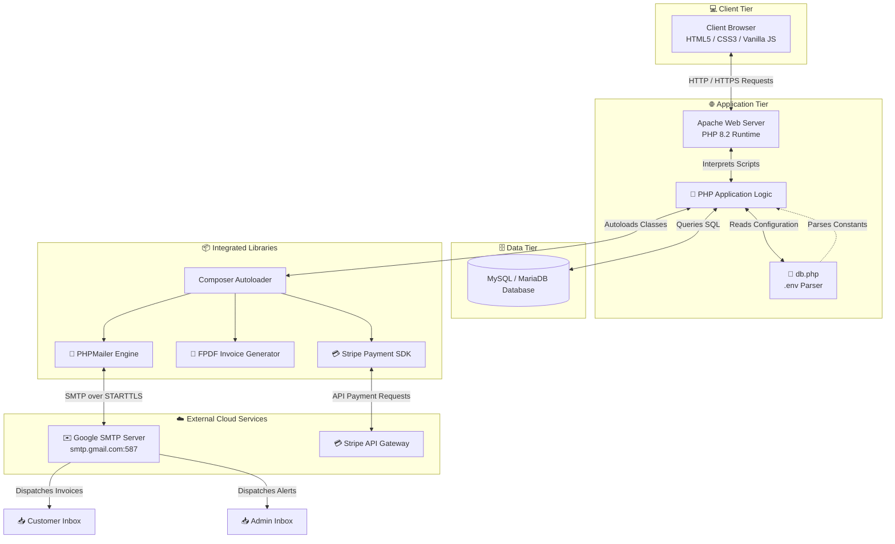
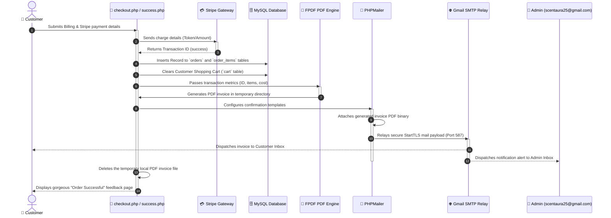
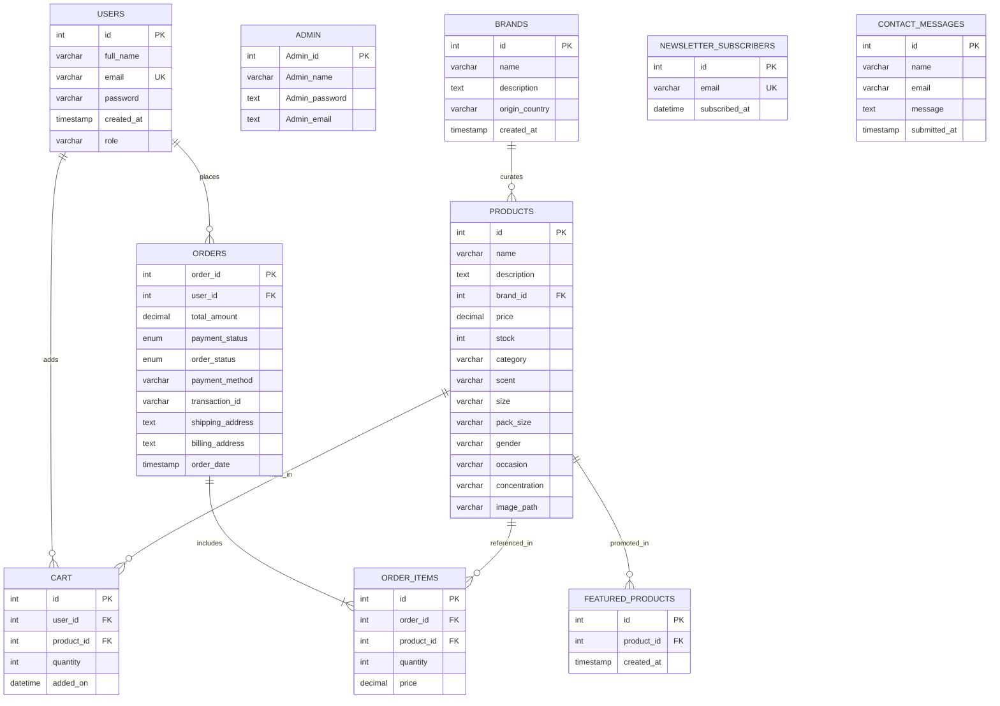

# 🌌 ScentAura - Luxury Fragrance E-Commerce Platform

Welcome to **ScentAura**, an ultra-premium, full-featured e-commerce platform dedicated to luxury perfumes and elite fragrances. Crafted using semantic PHP, MySQL, Vanilla CSS, and modern web design methodologies, ScentAura provides an exquisite, immersive, and responsive shopping experience for fragrance connoisseurs worldwide.

---

## 🌟 Table of Contents
1. [System Architecture](#-system-architecture)
2. [Database Design & ER Diagram](#-database-design--er-diagram)
3. [What Each Component Does](#-what-each-component-does)
   - [Customer Portal (Root Directory)](#customer-portal-root-directory)
   - [Shared Components & Assets (`/components`)](#shared-components--assets-components)
   - [Admin Portal (`/admin`)](#admin-portal-admin)
4. [Environment Configuration (`.env`)](#-environment-configuration-env)
5. [How to Run Locally](#-how-to-run-locally)
   - [Option A: Native Server (XAMPP / Apache / PHP)](#option-a-native-server-xampp--apache--php)
   - [Option B: Containerized Server (Docker & Docker Compose)](#option-b-containerized-server-docker--docker-compose)
6. [How to Run in Production](#-how-to-run-in-production)
   - [Production Infrastructure](#production-infrastructure)
   - [CI/CD Pipeline (GitHub Actions)](#cicd-pipeline-github-actions)
   - [Production Deployment Steps](#production-deployment-steps)
7. [Security & Version Control](#-security--version-control)

---

## 🏗️ System Architecture

ScentAura follows a decoupled multi-tier web application architecture. Below is the system flow showing the client interactions, application logic, dependencies, database storage, and external APIs.



### 📧 Order Processing & Invoice Flow

The sequence diagram below details the logical steps taken from checkout submission to payment gateway processing, transactional email creation, dynamic PDF invoice generation, and customer notification.



---

## 🗄️ Database Design (ER Diagram)

ScentAura's schema consists of 10 primary relational tables. The entity relationship diagram highlights their attributes, constraints, and foreign key mappings.



---

## 📂 What Each Component Does

A comprehensive structural audit of the project files.

### Customer Portal (Root Directory)

| File Name | Description |
| :--- | :--- |
| `index.php` | The main landing page. Highlights brand introductions, a carousel/testimonials slider, promotional sections, and handles newsletter subscription and contact form submissions directly, notifying administrators and users via PHPMailer. |
| `products.php` | The catalog browser. Incorporates client-side and server-side filtering by gender, scent categories, price ranges, and searches the active database dynamically. |
| `product_des.php` | Detailed product showcase. Renders the product notes hierarchy (head, heart, base), size configurations, concentrations (EDP, EDT, Cologne), stock indicators, and houses the add-to-cart operations. |
| `cart.php` | The user's active shopping cart. Displays current items, prices, and handles item additions, deletions, and direct quantity changes. |
| `checkout.php` | Billing and shipping portal. Gathers demographic information and initializes the secure payment gateway token logic. |
| `success.php` | Post-payment processor. Confirms transaction variables, updates inventory stocks, initiates the PDF invoice generator via FPDF, attaches the document to PHPMailer, and sends out transaction summaries. |
| `profile.php` | Customer dashboard. Exposes details and allows logged-in users to audit their order histories and payment records. |
| `about.php` | The brand statement page, describing ScentAura's core philosophies and story. |
| `blog.php` | A dedicated layout featuring articles, tips, and luxury perfume trends. |
| `contact.php` | Simple support portal exposing physical contact details and an interactive feedback box. |
| `login.php` | Unified gateway for user login and signup. Validates credentials securely using `password_hash()` and `password_verify()`. |
| `logout.php` | Clears all active variables and destroys the session, redirecting to the homepage. |
| `forgot_password.php` | Password reset request portal. Validates email, creates secure single-use tokens, stores them with an expiration limit, and mails the reset link via PHPMailer. |
| `reset_password.php` | Password reset verification and update processor. Confirms token validity and expiration window, securely hashes the new password, updates database records, and deletes token. |
| `db.php` | Database connection script. Houses the lightweight parser that extracts local environment variables from `.env` and establishes a global `$conn` via the MySQLi driver. |

### Shared Components & Assets (`/components`)

| Directory | Sub-component | Description |
| :--- | :--- | :--- |
| `/components/css` | `index.css`, `products.css`, etc. | Page-specific Vanilla CSS layouts providing the glassmorphic aesthetics, fonts, and dark configurations. |
| `/components/js` | `index.js`, `products.js`, etc. | Client-side scripting for sliders, dynamic price ranges, search updates, and front-end forms validations. |
| `/components/images` | `1.jpg`, background assets, etc. | Global imagery including high-definition backdrops, fragrance assets, and product photography. |
| `/components/logo` | `logo.png` | Standardized application logos and icons. |

### Admin Portal (`/admin`)

All administration files are kept secure within the `/admin` path:

| File Name | Description |
| :--- | :--- |
| `admin_login.php` | Private sign-in page for managing administrative authority levels. |
| `dashboard.php` | Main landing interface for admins, displaying high-level statistics like total users, active listings, order numbers, and registered brands. |
| `inventory.php` | Admin catalog overview table showing lists of all perfumes. Allows administrators to quickly manage items or search listings. |
| `product.php` | Product CRUD handler. Permits admins to add new perfumes, modify attributes (prices, stocks, sizes, notes), and upload product photos directly to `admin/uploads/`. |
| `featured_products.php` | Controller mapping which catalog items are highlighted on the main customer-facing landing page. |
| `brand.php` | Brand registry CRUD manager allowing administrators to add or configure luxury perfume makers, their descriptions, and countries of origin. |
| `orders.php` | Transaction log table displaying user order IDs, Stripe hashes, shipping destinations, totals, and statuses. |
| `users.php` | Customer registration audit list showing names, emails, signup timestamps, and administrative roles. |
| `settings.php` | Admin control panel for updates to system constants (SMTP port configurations, active email credentials, and passwords). |
| `scentaura.sql` | The master SQL schema setup script containing definitions and relational seed data. |

---

## 🔐 Environment Configuration (`.env`)

ScentAura reads settings securely from a `.env` file placed in the root directory. 

Create a `.env` file using the following schema:

```env
# Relational Database Connection
DB_HOST=localhost
DB_USER=root
DB_PASSWORD=rootpassword
DB_NAME=scentaura

# Stripe Gateway Credentials
STRIPE_PUBLISHABLE_KEY=pk_test_your_stripe_publishable_key
STRIPE_SECRET_KEY=sk_test_your_stripe_secret_key

# SMTP Configuration (PHPMailer Email Client)
SMTP_HOST=smtp.gmail.com
SMTP_PORT=587
SMTP_USER=scentaura25@gmail.com
SMTP_PASS="your_google_app_password"
SMTP_SECURE=tls
```

> [!IMPORTANT]
> **Gmail App Password Setup:** Traditional passwords will fail due to Google's API policies.
> 1. Go to your **Google Account Settings** and search for **App Passwords** (Ensure *2-Step Verification* is enabled).
> 2. Create a name (e.g. "ScentAura") and generate the unique 16-character code.
> 3. Save it directly into the `SMTP_PASS` field in `.env` without spaces.

---

## 🚀 How to Run Locally

You can launch ScentAura locally using either a traditional PHP server environment (XAMPP/Apache) or Docker containers.

### Option A: Native Server (XAMPP / Apache / PHP)

#### 1. Position Code in Server Root
Clone the repository and copy it directly to your server's public document root directory:
* **Windows (XAMPP):** `C:\xampp\htdocs\Scentaura`
* **Linux (Apache):** `/var/www/html/Scentaura`
* **macOS:** `/Library/WebServer/Documents/Scentaura`

#### 2. Install Vendor Dependencies
Navigate to the root directory in your terminal and compile third-party libraries:
```bash
composer install
```

#### 3. Setup Relational Database
1. Start your local Apache and MySQL services (e.g., via the XAMPP Control Panel).
2. Open **phpMyAdmin** in your browser (`http://localhost/phpmyadmin`).
3. Create a new database named **`scentaura`** with collation `utf8mb4_general_ci`.
4. Select the newly created database, navigate to the **Import** tab, choose the `/admin/scentaura.sql` file, and execute the import.

#### 4. Configure Local Variables
Create a local `.env` file in the project root:
```bash
cp .env.example .env
```
Fill out your database username (usually `root` with no password locally) and SMTP/Stripe details.

#### 5. Launch
Access the portals:
* **Customer Frontend:** `http://localhost/Scentaura/index.php`
* **Admin Dashboard:** `http://localhost/Scentaura/admin/admin_login.php`

---

### Option B: Containerized Server (Docker & Docker Compose)

This approach automatically configures a PHP-Apache container and a MySQL 8.0 database container, linking them together on a local virtual network.

#### 1. Initialize Containers
Run the following build command in the project root directory:
```bash
docker-compose up --build -d
```
This command:
* Compiles the local `dockerfile` based on `php:8.2-apache`.
* Installs dependencies (Composer, standard unzip/curl, and `mysqli` extensions).
* Pulls a official `mysql:8.0` image.
* Maps the web container to host port `8080` and the database to host port `3307`.
* Establishes a persistent volume (`db_data`) for the database state.

#### 2. Import Master SQL Schema
Since the database container initiates blank, you must run the schema file (`admin/scentaura.sql`) inside the container:
```bash
# Locate your running MySQL container name or ID
docker ps

# Stream the local SQL script into the running database container
docker exec -i <database_container_id_or_name> mysql -uroot -prootpassword scentaura < admin/scentaura.sql
```
*(Replace `<database_container_id_or_name>` with the actual name or ID of the MySQL container, e.g. `scentaura-db-1`)*

#### 3. Access Portals
* **Customer Frontend:** `http://localhost:8080/index.php`
* **Admin Dashboard:** `http://localhost:8080/admin/admin_login.php`

---

## ☁️ How to Run in Production

ScentAura is structured to deploy containerized code to **Amazon Web Services (AWS)** using a combination of **Amazon ECR** (Elastic Container Registry), **Amazon ECS** (Elastic Container Service), and managed **Amazon RDS** (Relational Database Service).

### Production Infrastructure

* **Container Engine:** Amazon ECS running on Fargate (serverless containers) or EC2 instances.
* **Registry:** Amazon ECR storing versioned Docker images.
* **Database:** Managed Amazon RDS (MySQL 8.0 Engine) in a Multi-AZ layout for high availability.
* **SSL/TLS:** AWS Certificate Manager (ACM) mapped to an Application Load Balancer (ALB) routing secure HTTPS traffic.

---

### CI/CD Pipeline (GitHub Actions)

Deployments are automated through the GitHub Actions workflow located in `.github/workflows/deploy.yml`. When code is pushed to the `main` branch, the pipeline builds the container, pushes it to ECR, and updates the active ECS service.

```mermaid
graph LR
    Push[1. git push origin main] --> Action[2. GitHub Actions Trigger]
    Action --> Creds[3. Authenticate AWS CLI via Secrets]
    Creds --> Build[4. Build & Tag Docker Image]
    Build --> ECR[5. Push Image to ECR Repository]
    ECR --> ECS[6. ECS Task Definition Update & Service Refresh]
    ECS --> Task[7. Spin Up New Tasks & Drain Old Containers]
    Task --> Test[8. Smoke Test Key URLs on Base IP]
```



---

### Production Deployment Steps

#### 1. Set Up Database Instance (AWS RDS)
1. Launch a MySQL 8.0 database instance on Amazon RDS.
2. Ensure the RDS Security Group allows inbound MySQL traffic (Port `3306`) from the Security Group associated with your future ECS Tasks.
3. Use a MySQL GUI (e.g. DBeaver) to connect to the RDS endpoint, create a database named `scentaura`, and run the SQL setup script (`admin/scentaura.sql`).

#### 2. Configure GitHub Repository Secrets
Navigate to your GitHub Repository -> **Settings** -> **Secrets and variables** -> **Actions** and create the following secrets:
* `AWS_ACCESS_KEY_ID`: Your IAM user access key.
* `AWS_SECRET_ACCESS_KEY`: Your IAM user secret key.

*(Note: The IAM user must possess permissions to push to ECR and update ECS tasks, such as `AmazonEC2ContainerRegistryPowerUser` and `AmazonECS_FullAccess`)*

#### 3. Create ECR Repository & ECS Resources
1. **ECR Repository:** Create a private registry named `scentaura`.
2. **ECS Cluster:** Create a cluster named `scentaura-cluster`.
3. **Task Definition:** Create a task definition named `scentaura-task` containing:
   - A container named `scentaura-app`.
   - Ports mapping `80` inside the container to `80` (or dynamic host ports).
   - Injected Environment variables (mapping database configurations to your RDS endpoint):
     * `DB_HOST`: Address of your RDS MySQL endpoint.
     * `DB_USER`: Master database username.
     * `DB_PASSWORD`: Master database password.
     * `DB_NAME`: `scentaura`
     * `STRIPE_SECRET_KEY`, `STRIPE_PUBLISHABLE_KEY`, `SMTP_HOST`, `SMTP_PASS`, etc.
4. **ECS Service:** Create a service named `scentaura-service` inside the cluster to manage and scale the tasks.

#### 4. Trigger Deployment
Pushing your updates to the master branch will execute the pipeline:
```bash
git add .
git commit -m "ci: deploy luxury platform to AWS container cluster"
git push origin main
```
The workflow will:
1. Compile the image: `docker build -t scentaura-app .`
2. Tag the build: `docker tag scentaura-app:latest 976497228635.dkr.ecr.ap-south-1.amazonaws.com/scentaura:latest`
3. Push to ECR.
4. Issue a deployment signal: `aws ecs update-service --cluster scentaura-cluster --service scentaura-service --task-definition scentaura-task:3 --force-new-deployment`
5. **Run a Smoke Test**: Performs curl checks to confirm the server returns status code `200` on key routes:
   - Base URL (`http://13.203.156.238`)
   - Products page (`/products.php`)
   - Login page (`/login.php`)
   - Blog page (`/blog.php`)
   - About page (`/about.php`)
   - Contact page (`/contact.php`)

---

## 🛡️ Security & Version Control

To prevent sensitive credentials, passwords, and private parameters from being leaked, ScentAura is configured with a robust `.gitignore` file.

The following directories and files are permanently excluded from version control tracking:
* **`.env`** - Protects your Stripe secret keys and SMTP mail app passwords.
* **`/vendor/`** - Excludes large dependency trees managed by Composer.
* **`admin/uploads/`** - Excludes locally uploaded fragrance image assets.
* **Operating System files** (`.DS_Store`, `Thumbs.db`).

Make sure to never commit credential variables directly into PHP scripts. Always load parameters using `getenv()` or the global `$_ENV` array initialized by `db.php`.

---

## 👥 Contributors
Developed with passion by the **ScentAura Dev Team**. For support, issues, or inquiries, reach out to `scentaura25@gmail.com`.

