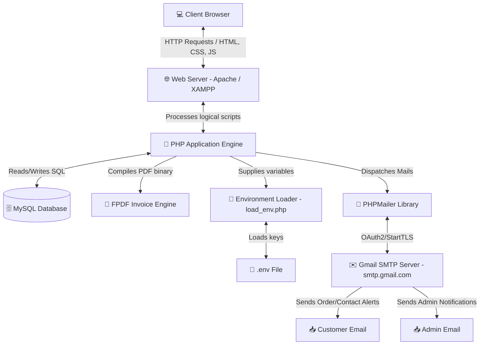
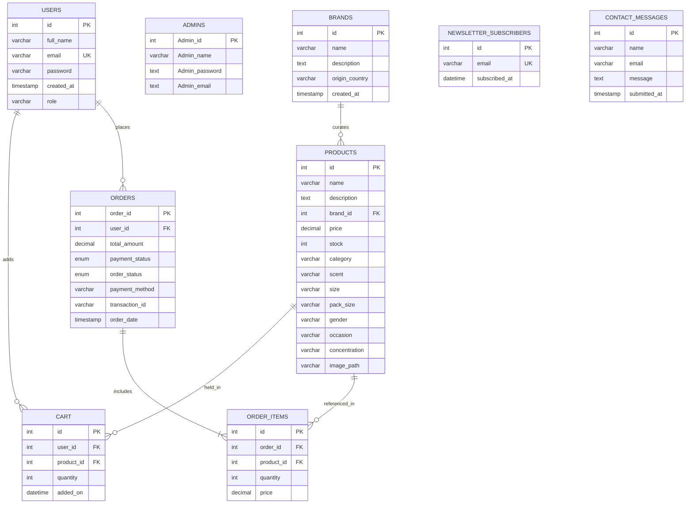
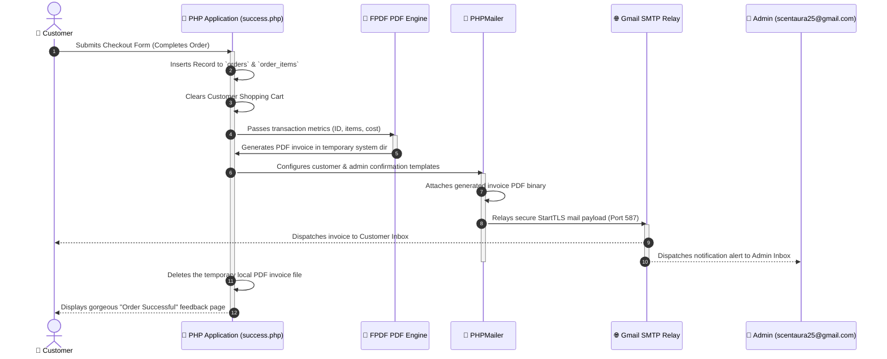

# 🌌 ScentAura - Luxury Fragrance E-Commerce Platform

Welcome to **ScentAura**, an ultra-premium, full-featured e-commerce platform dedicated to luxury perfumes and elite fragrances. Crafted using semantic PHP, MySQL, Vanilla CSS, and modern web design methodologies, ScentAura provides an exquisite, immersive, and responsive shopping experience for fragrance connoisseurs worldwide.

---

## 🌟 Table of Contents
1. [Key Features](#-key-features)
2. [System Architecture](#-system-architecture)
3. [Database Design (ER Diagram)](#-database-design-er-diagram)
4. [Invoice & Email Flow](#-invoice--email-flow)
5. [Prerequisites](#-prerequisites)
6. [Local Installation Guide](#-local-installation-guide)
7. [Environment Configuration (.env)](#-environment-configuration-env)
8. [Security & Version Control](#-security--version-control)

---

## ✨ Key Features

### 👤 Customer-Facing Experience
* **Stunning Design Aesthetics:** Visually striking glassmorphism elements, curated typography, harmonized premium palettes, and buttery-smooth micro-animations.
* **Smart Catalog Navigation (`products.php`):** Responsive grid of exquisite scents equipped with advanced category and gender-based filters.
* **Rich Product Showcases (`product_des.php`):** Immersive product detail pages detailing note compositions (head, heart, and base notes), concentration levels (EDP, EDT, Cologne), size configurations, and real-time stock indicators.
* **Fluid Shopping Cart (`cart.php`):** Add, update, and manage items in real-time with automatic cost adjustments.
* **Seamless Checkout (`checkout.php` & `success.php`):** Streamlined billing and shipping details collection with integrated secure payments.
* **Automated PDF Invoicing:** Direct PDF generation utilizing `FPDF` for completed orders, which is saved securely on the server and attached to order confirmation emails.
* **Newsletter Subscription:** Stay updated with exclusive product launches and seasonal offers.

### 🔑 Administrator Portal (`/Admin`)
* **Live Dashboard:** Instant insights into inventory volumes, active users, total brand list, and historical orders.
* **Robust Inventory Management:** Fully functional CRUD interface for managing product catalog, descriptions, prices, stock levels, concentration types, and HD imagery uploads.
* **Brand Curator:** Dedicated brand register database showing description and country of origin.
* **Order & User Auditor:** Visual trackers for analyzing recent order details, transaction hashes, and customer lists.

---

## 🏗️ System Architecture

The following block diagram demonstrates the interaction between the frontend client, back-end logical engines, local asset controllers, external SMTP relay services, and the centralized relational database.



---

## 🗄️ Database Design (ER Diagram)

ScentAura's structural foundation revolves around 10 carefully indexed relational tables. The diagram below shows their constraints and foreign-key mappings.



---

## 📧 Invoice & Email Flow

When an order is successfully finalized, ScentAura executes an automated transaction process to compile paperwork and notify relevant stakeholders.



---

## 🛠️ Prerequisites

To run this application locally, ensure you have the following software installed:
* **PHP:** Version 8.0 or higher
* **MySQL:** Version 5.7 or higher (MariaDB 10.4+)
* **Composer:** For managing third-party PHP packages
* **Web Server:** XAMPP, WAMP, Laragon, or Apache locally
* **Git:** For tracking changes and version management

---

## 🚀 Local Installation Guide

Follow these steps to deploy and run ScentAura on your local system:

### 1. Position Code in Server Directory
Clone or move the `ScentAura` directory into your local server root folder:
* **XAMPP (Windows):** `C:\xampp\htdocs\ScentAura`
* **Linux (Ubuntu/Apache):** `/var/www/html/ScentAura`
* **macOS:** `/Library/WebServer/Documents/ScentAura`

### 2. Install Vendor Dependencies
Navigate to the root directory using your terminal and install packages specified in `composer.json` (such as `PHPMailer` and `Stripe`):
```bash
composer install
```

### 3. Initialize Relational Database
1. Launch **phpMyAdmin** in your browser (`http://localhost/phpmyadmin`).
2. Create a new database named **`scentaura`**.
3. Select the `scentaura` database, click the **Import** tab.
4. Choose the file located at: `/admin/scentaura.sql`.
5. Click **Go / Import** at the bottom to build the schema tables and load seeded values.

### 4. Create and Configure Environment Variables
Copy the environment variables template to create your secure `.env` file:
```bash
cp .env.example .env
```
Open the `.env` file and replace the configurations with your own database and SMTP server parameters (refer to the [Environment Configuration](#-environment-configuration-env) section below).

### 5. Access the Web Application
Open your browser and navigate to:
* **Customer Portal:** `http://localhost/ScentAura/index.php`
* **Admin Portal:** `http://localhost/ScentAura/admin/admin_login.php`

---

## 🔐 Environment Configuration (.env)

ScentAura utilizes a custom, lightweight, high-performance environment file parser (`load_env.php`) that parses standard `.env` parameters without external libraries. 

Save your local database and SMTP configuration parameters inside `.env` in the project root:

```env
# Database Configuration
DB_HOST=localhost
DB_USER=root
DB_PASSWORD=""
DB_NAME=scentaura

# SMTP Mailer Configuration
SMTP_HOST=smtp.gmail.com
SMTP_PORT=587
SMTP_USER=scentaura25@gmail.com
SMTP_PASS="your_gmail_app_password"
SMTP_SECURE=tls
```

> [!IMPORTANT]
> **Gmail SMTP Setup:** If you are using Gmail, standard passwords will fail due to Google's strict security protocols. 
> To generate an App Password:
> 1. Go to your **Google Account Settings**.
> 2. Search for and select **App Passwords** (Ensure *2-Step Verification* is active on your account).
> 3. Enter a custom name like "ScentAura Mailer" and click **Create**.
> 4. Copy the unique 16-character code and paste it directly into `SMTP_PASS` inside your `.env` file.

---

## 🛡️ Security & Version Control

To prevent sensitive operational parameters and user passwords from being leaked into public repositories, ScentAura is configured with a robust `.gitignore` setup.

The following files are permanently excluded from Git tracking:
* **`.env`** - Keeps production credentials (DB pass, SMTP keys) private.
* **`/vendor/`** - Excludes heavy external dependencies managed by Composer (ensuring quick, optimized clones).
* **System files (`.DS_Store`, `Thumbs.db`)** - Keeps repo trees clean of operating-system metadata.

If setting up Git manually, run the following:
```bash
git init
git add .
git commit -m "feat: integrate secure environment configs and complete documentation"
```

---

## 👥 Contributors
Developed with passion by the **ScentAura Dev Team**. For questions or feedback, reach out to `scentaura25@gmail.com` or call customer support.
